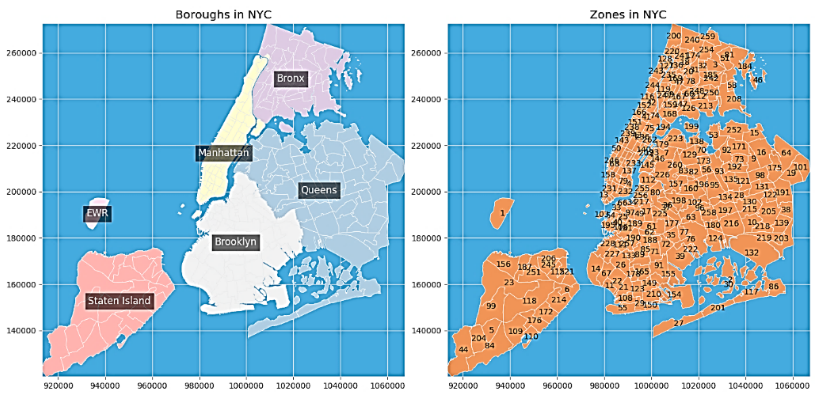
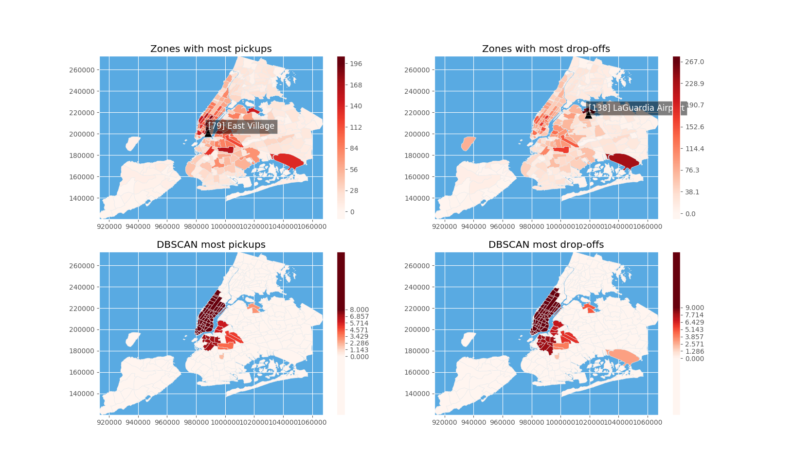
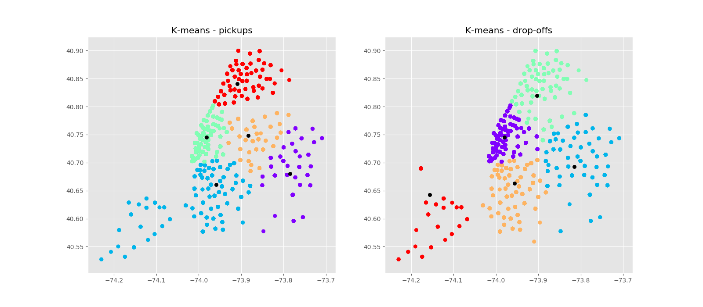
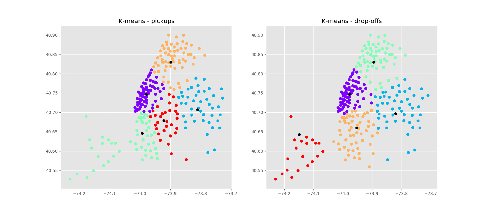
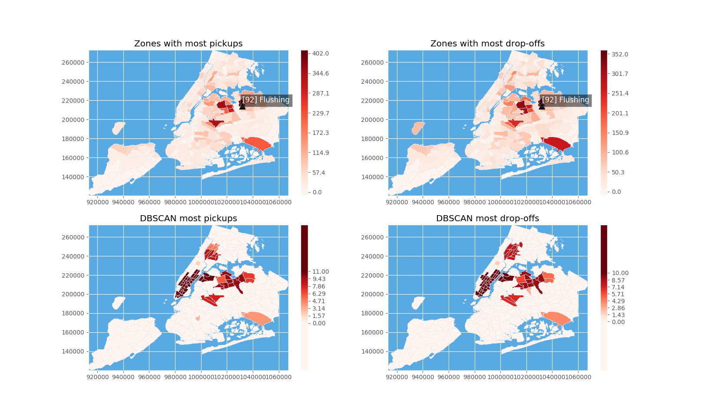
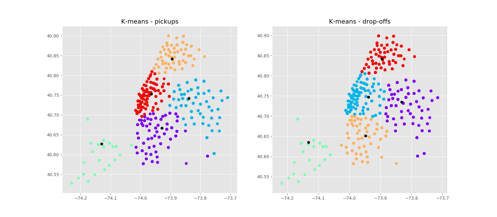
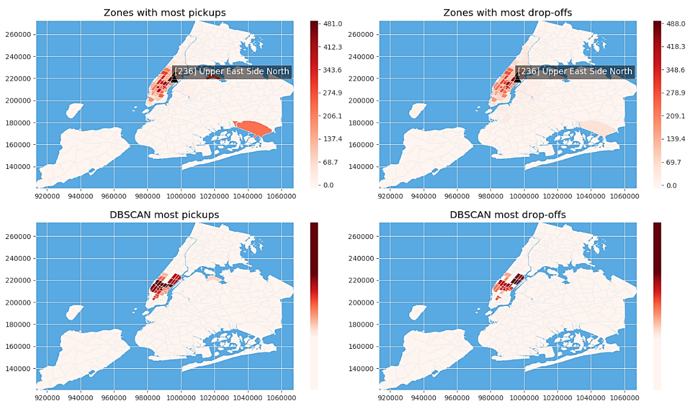

# NYC taxi dataset exploration using Data Mining

In this fun little project, we explore the NYC taxi data sets to find hotspots throughout the city, compare pick_up and drop_off locations and see how for-hire-vehicles took over different zones of the city from the conventional yellow cabs.

## Introduction

Trip data analysis can produce numerous benefits. Based on the findings, we will be able to have a more accurate concentration of public transportation facilities, as well as adding more, if possible. Thus, less waiting times and more convenience for both passengers and drivers. In addition, by comparing the areas of dominance of different taxi services, each service could strive to get back into competition by offering competitive services in the areas of interest.

Our main goal here is to determine the hotspots of the city based on pickups and drop-offs in the trip records. There are different approaches to find these hotspots and, in this project, we seek to find the best approach that yields the best results.

In this study, we will apply different clustering algorithms to find pickup and drop-off hotspots of New York City, based on the trip records provided by the NYC Taxi and Limousine Commission (TLC). We will be looking at trip data belonging to different years and analyze the battle of For-Hire-Vehicles vs. taxi through the evolution of FHVs. In order to evaluate the results, we will use different clustering validation scores.

We will start by the methodology section, going over the algorithms and methods used to tackle the problem. Next, the experimental evaluation is explained, which includes details about the data, preprocessing, the experimental setup, and the results. Lastly, a conclusion that summarizes and discusses the results, is presented.

## Methodology

The main approach in this project is clustering. In other words, the hotspots of the city will be clusters found by different algorithms. Various types of clustering algorithms are available. There are the centroid models, like the k-means algorithm, which produce a single data point as a representative for each cluster, and the density-based models, like DBSCAN and OPTICS, which define clusters as connected dense regions in the data space.

The first challenge here is to choose the most suitable clustering algorithm. Because hotspots are essentially defined as the parts of the city with the greatest numbers of pickups/drop-offs nearby, it seems more appropriate to choose a density-based algorithm. That said, we will not discard the idea of trying out other methods altogether. It seems only reasonable to have another method at hand for the sake of comparison. Hence, DBSCAN and K-means algorithms will both be studied alongside each other. Let us briefly go over the concepts and the pros and cons of each of these algorithms.

The concept behind K-means is to find cluster centers that are representatives of certain regions in the data space. The algorithms alternates between two steps to try and find those representatives: assigning each point to the closest cluster center, and then setting each cluster center as the mean of the data points assigned to it. As easy and efficient as this process might look, there are weaknesses as well. Apart from needing to define &quot;mean&quot; and to specify the number of clusters, the algorithm is sensitive to noisy data and outliers, and clusters are forced to have convex shapes. It is also worthy of mentioning that results are very dependent on the initial partitions; which means the algorithm often terminates at a local optimum.

DBSCAN stands for density-based spatial clustering of applications with noise. As the name suggests, the algorithm works by identifying points that are in dense regions of the feature space, separated by regions of lower object density. At every run, it determines whether an object is a core point (having a minimum number of points in its reachability), and then collects all objects that are density-reachable from it; Core points that are closer to each other than the distance &quot;_epsilon_&quot; are then put into the same cluster. DBSCAN provides many advantages: most importantly, the number of clusters is determined automatically, and clusters can have arbitrary shapes and sizes. Additionally, the algorithm can separate clusters from the surrounding noise points, and it&#39;s, also, supported by spatial index structures. Indeed, there are shortcomings to this algorithm, as well. Input parameters &quot;min-points&quot; and &quot;epsilon&quot; could be difficult to determine, and, in some situations, the results are very sensitive to these input parameter settings.

After deciding on the clustering algorithms, we need a cluster validation method to evaluate and compare the results. Since we do not have the ground truths in this project, we will be using the Silhouette Coefficient. The silhouette value is a measure of how similar (close) an object is to the points in its own cluster, compared to the points in other clusters. It ranges from -1 to +1, while a higher value is indicative of a better clustering structure

## Experimental Evaluation

## Dataset Analysis

The trip data provided on the website is separated for different types of taxis, e.g. FHV and Taxis (yellow and green). The FHV datasets include data belonging to 2015-2019, while the yellow and green taxis have data from 2009 to 2019. Feature included in all datasets are the pickup and drop-off times and location IDs. Some taxi datasets also include additional information, such as, passenger count, trip distance, and fare amounts.

The main features in this project, pickup and drop-off locations, are, unfortunately, not precise points. Instead, the entire city is divided into zones with arbitrary shapes and surface areas, each having a unique ID. The zone IDs are then provided for each trip in the datasets. Valid location IDs are from 1 to 263. Figure 1 demonstrates the different boroughs of the city and how the zones construct the entire city area.

_Figure 1: NYC boroughs – zones_

## Preprocessing

The preprocessing for this project is done in three steps: dealing with missing/unknown values, extracting the (X, Y) coordinates for the location IDs, and scaling. We will go over each step briefly.

- _ **Missing and Unknown Values** _: there are two approaches to dealing with these values: replacing them with the mean or median or, removing these samples altogether. Because of the large amount of data that we have, here, and the fact that we will be sampling a number of points from the datasets to be able to perform the computations fast enough, it makes more sense to remove those points entirely.

- _**(X, Y) Coordinates**_: in order to perform the clustering, we need the (X, Y) coordinates of the pickup/drop-off locations to calculate the distances. To this end, we need a dataset of locations assigning each to a set of coordinates. We can use the shapefile provided o the website to extract this information. We can use a website to generate a CSV file, or, better yet, use the python Shapefile library which will give us more capabilities as well, throughout the entire project.

- _ **Scaling** __:_ it is a known fact that scaling the data will give us more efficiency and, even better results, as well. Standardization is the method chosen here, which will transform data to have a zero mean and a standard deviation of 1.

## Experimental Setup

All of the algorithms and methods used in the project are coded in python, using the following libraries: NumPy, Pandas, Scikit-learn, Shapefile, Shapely, Matplotlib, and Seaborn. The data sets used for analysis are the FHV datasets belonging to the years 2017, 2018, and 2019, since before 2017 pickup and drop-off locations are not separated, and each trip has only one location ID. Additionally, the 2019 data for yellow taxi is used for a general comparison. We will sample 10,000 data points for each taxi type in each year, which seems to be a good representative of the entire data space and, also, makes computation times more reasonable.

## Results

To be able to analyze and compare the results in the best way, the results for each year will be presented separately. For each year, we will first take a glance at the trips by just counting the number of pickup/drop-offs in each zone and drawing the corresponding heat-map. Next, the clustering results using DBSCAN and K-means will be presented. Lastly, we will go over the cluster validation results using the Silhouette Coefficient.

### 2017

Figure 2 first demonstrates the heat-map constructed by just counting the number of pickup/drop-offs in each zone (top) and then the DBSCAN clustering results (bottom).

_Figure 2: 2017 Heatmaps based on counts (top) and DBSCAN (bottom)_

In DBSCAN results, points in the same cluster all have the same color, and the hotter the color, the larger the cluster is. As we can see, the results indicated by merely counting is a lot different than what DBSCAN tells us. The reason behind this is because the zones are all of vastly different sizes. Hence, by counting, we are essentially disregarding density information. For instance a zone with a large surface area like JFK Airport (bottom right in the map) would be a major hotspot of the city by counting, whereas in DBSCAN results it&#39;s one of the smallest clusters, due to its large area and relative low pickups/drop-offs in the vicinity. Instead, DBSCAN gives us Manhattan as the number 1 hotspot, which makes sense because it is constructed by numerous small zones.

Figure 3 illustrates the clustering done by the K-means algorithm. K is set to 5 as it seems to suit the data space well.

_Figure 3: 2017 – K-means results_

In K-means clustering results, every cluster has a different color, while the cluster centers are shown in black. Although the partitioning seems satisfactory on its own, cluster centers are scattered throughout the city, covering almost all of the area, which fails to give us any insight as to where the city hotspots are. This is mainly due to the algorithm&#39;s sensitivity to noisy data and outliers.

### 2018

2018 heatmaps and DBSCAN results are presented in figure 4.

_Figure 4: 2018 Heatmaps based on counts (top) and DBSCAN (bottom)_

Comparing the zone heatmaps of 2018 with the year before, we can see that it&#39;s more spread throughout the city, meaning more people are using For-Hire-Vehicles in all zones of the city. Looking at the hotspots found by DBSCAN clustering, without seeing a major difference in the main hotspots we observe an expansion in almost all clusters. We also notice that some new clusters are introduced in the upper parts of the city, in addition to more drop-offs to the JFK airport. These changes all confirm that FHVs are winning over more parts of the city.

Figure 5 shows K-means results for 2018.

_Figure 5: 2018 – K-means results_

Once again, we can see that the k-means cluster centers are dispersed all over the city, covering almost every part. Hence, it fails to help us with any kind of hotspot analysis. Nonetheless, the algorithm seems to have separated the 5 boroughs of the city, well.

### 2019

Finally, the results for the last year, 2019, are depicted in figures 6 and 7. By comparing the hotspots of 2019 and 2018, we observe a shift towards the mid-right part of the city. Even though the largest cluster is still in Manhattan, we now also have major hotspots in the upper part of Queens. This means that the FHV services have found their way into the lives of the people from the middle class, as well as the upper-class people in Manhattan. This might be because of more competitive fares and also good marketing. Unfortunately, we do not have any information about trip fares for the FHVs to back this up.

_Figure 6: 2019 Heatmaps based on counts (top) and DBSCAN (bottom)_

_Figure 7: 2019 – K-means results_

At this point, it might also be interesting to have a comparison between the FHVs and a more traditional type of taxi that&#39;s been around for some time, the Yellow Taxi. Figure 8 shows the heatmaps and DBSCAN clustering results for the Yellow Taxi in 2019. The K-means results are skipped this time, as they provided little information about the hotspots.

_Figure 8: 2019 Yellow Taxi Heatmaps based on counts (top) and DBSCAN (bottom)_

When comparing the two services, the first thing we notice is that on the contrary to the FHVs, Yellow taxis only operate in Manhattan, a small part of Queens and the JFK airport. Even in Manhattan, FHVs are the clear winner, covering more ground. We can also see that the JFK airport is dominated by the FHVs, as well, especially in the drop-offs.

Now, let&#39;s take a look at the parameters and the silhouette coefficient of the algorithms. Tables 1 and 2 demonstrates the findings. It should be mentioned that there are two No. of clusters for pickups and drop-offs, respectively.

_Table 1: DBSCAN parameters and silhouette coefficient_

| **eps** | **MinPoints** | **Dataset** | **No. clusters** | **No. noise point** | **Silhouette** |
| --- | --- | --- | --- | --- | --- |
| **0.23** | 200 | 2017 – FHV | 7 – 8 | 2985 | 0.584 |
| **0.23** | 200 | 2018 – FHV | 8 – 10 | 2864 | 0.323 |
| **0.23** | 200 | 2019 – FHV | 11 – 9 | 3287 | 0.572 |
| **0.23** | 200 | 2019 – Yellow | 8 – 9 | 3186 | 0.461 |

_Table 2: K-means parameters and silhouette coefficient_

| **K** | **Dataset** | **Silhouette** |
| --- | --- | --- |
| **5** | 2017 – FHV | 0.452 |
| **5** | 2018 – FHV | 0.435 |
| **5** | 2019 – FHV | 0.402 |

Although the silhouette coefficient did not prove to be the best validation method in this project as it sometimes produced higher values for clusterings that were clearly not beneficial (e.g. showing most of the city as a big cluster), we can see that the values obtained for DBSCAN results are mostly higher than those for K-means.

# Conclusion

In this study, we used clustering analysis to observe and compare New York City&#39;s hotspots over the years, based on For-Hire-Vehicle and Yellow Taxi trip records provided by the NYC Taxi and Limousine Commission (TLC). We applied DBSCAN and K-means algorithms and determined that for this project DBSCAN is a much more suitable tool than K-means, in order to extract information about the city&#39;s hotspots. We also showed that merely counting the number of trips in each zone can be misleading, due to the vast differences in the zones&#39; sizes. By analyzing DBSCAN results, we realized how and why the hotspots changed each year compared to the year before and, finally, we went over a comparison between FHV and Yellow Taxi hotspots of 2019.
